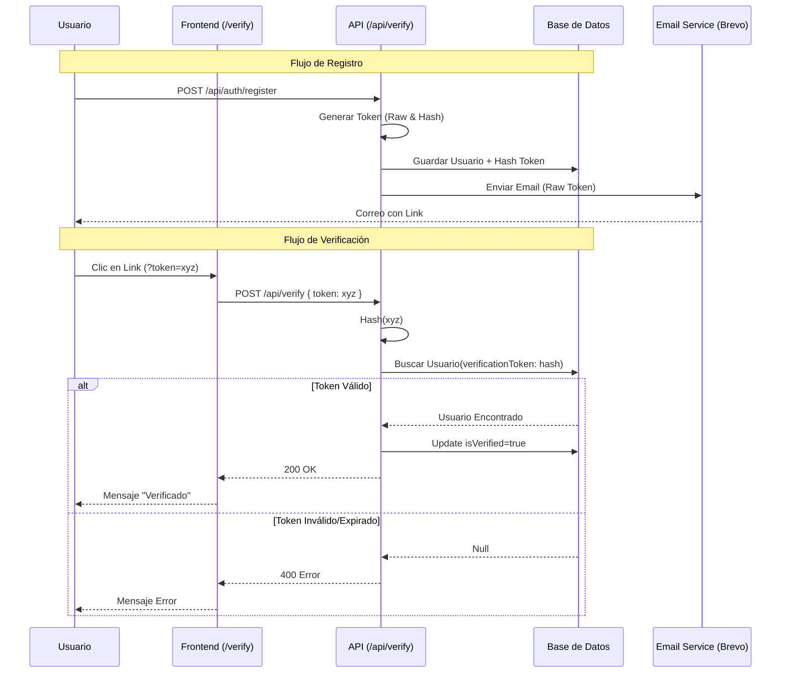

# Sistema de Verificación de Email

Este documento describe la implementación del sistema de verificación de correo electrónico.

## Flujo Técnico

1.  **Registro**:
    -   El usuario se registra en `/register`.
    -   Se genera un token criptográfico único (32 bytes hex).
    -   Se guarda el **hash SHA-256** del token en la base de datos junto con la fecha de expiración (24h).
    -   Se envía el token **sin hashear** por correo electrónico usando Brevo.

2.  **Verificación**:
    -   El usuario hace clic en el enlace `https://tudominio.com/verify?token={token}`.
    -   El frontend (`/verify`) captura el token y llama a la API `/api/verify`.
    -   La API hashea el token recibido y busca un usuario con ese hash y que no haya expirado.
    -   Si es válido, se marca `isVerified = true` y se borra el token.

## Diagrama de Secuencia



## Configuración de Brevo

Para que el sistema funcione, configura las siguientes variables de entorno en `.env`:

```env
BREVO_SMTP_HOST=smtp-relay.brevo.com
BREVO_SMTP_PORT=587
BREVO_SMTP_USER=tu_email_login_brevo
BREVO_SMTP_PASSWORD=tu_api_key_smtp
NEXT_PUBLIC_APP_URL=http://localhost:3000 # O tu dominio en producción
```

## Endpoints Implementados

-   **POST /api/auth/register**: Inicia el proceso de verificación.
-   **POST /api/verify**: Valida el token y activa la cuenta.
-   **POST /api/verify-email**: (Opcional) Permite reenviar el correo de verificación.
